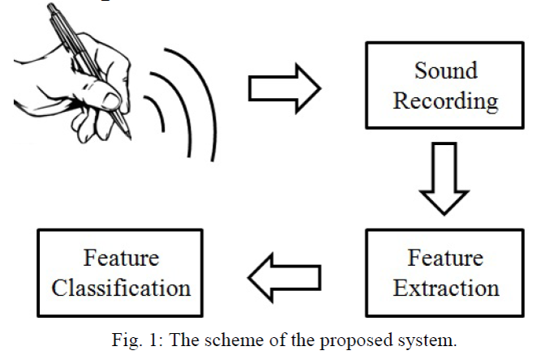
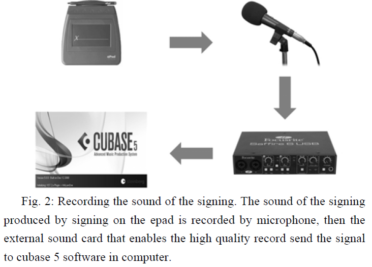
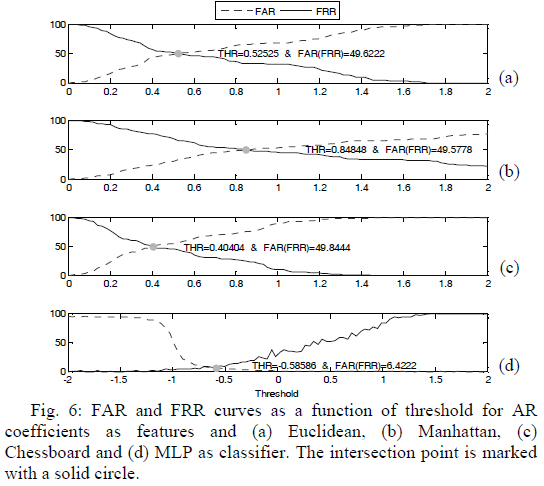

# A Unimodal Neural Network-Based Person Authentication System Based on the Sound of the Signing
Traditional person authentication systems are based on the person name, signature, password, and person identification number (PIN). In recent years researchers have focused on more subject-specific features that are based on the physiological and behavioural traits of human. In this work, the sound generated during signing is recorded as a behavioural parameter, and analyzed for person authentication. In the proposed unimodal person authentication system, fifteen volunteer participated. For processing of the sound signals, four different types of features based on cepstrum and parametric models, and four different types of classifiers based on distance and artificial neural network (ANN) were analyzed. For evaluation of the proposed authentication system false accept rate (FAR) and false reject rate (FRR) metrics were calculated with 10×10 fold cross-validation strategy. The objective of the work is to reduce the FAR and FRR metrics. The results demonstrated that the autoregressive (AR) features with multilayer perceptron (MLP) classifier has the best result in terms of FAR and FRR.

## Scheme of the system

## Some results

# How to cite
* F. Afdideh, et al., "A Unimodal Neural Network-Based Person Authentication System Based on the Sound of the Signing," to be published.
